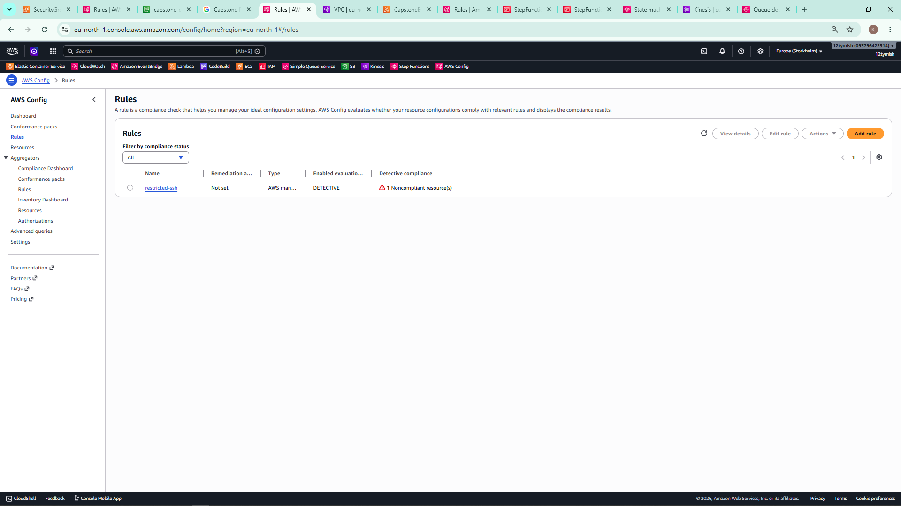
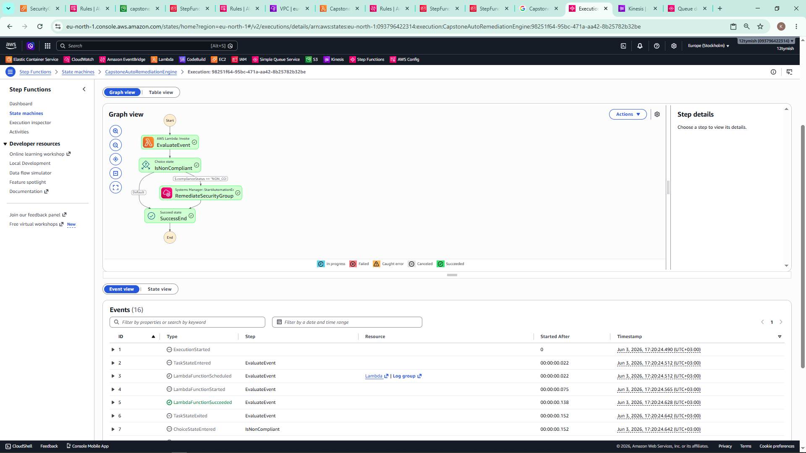
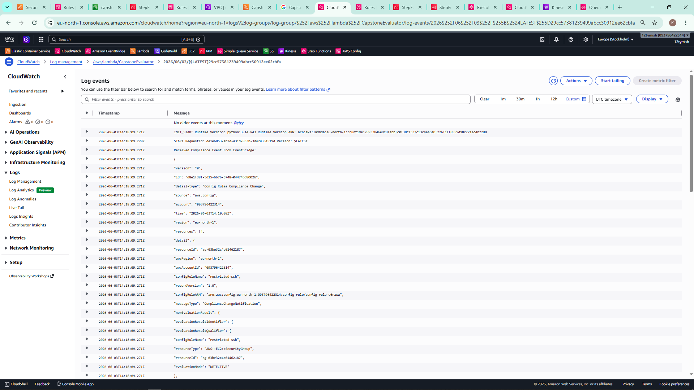
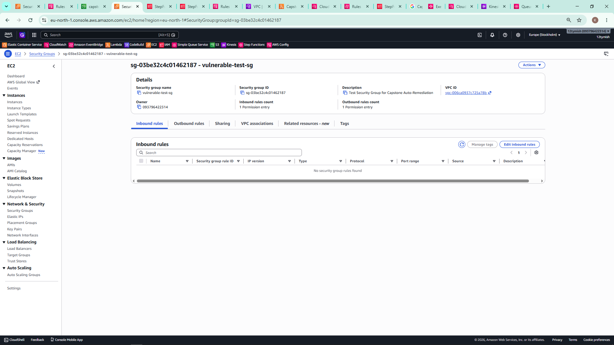

# aws-event-driven-remediation
# Event-Driven Auto-Remediation and Observability System on AWS

## Project Architecture & Flow Description
1. **Detection Engine**: AWS Config monitors security configuration drift continuously. It instantly catches any open SSH security groups using the `restricted-ssh` managed baseline check.
2. **Event Router & Fan-out Engine**: Amazon EventBridge catches non-compliant rules changes and matches them via custom JSON filtering patterns. It triggers 3 isolated data consumers in parallel:
   * **Amazon SQS**: Logs raw event payloads asynchronously for compliance audit trails.
   * **Amazon Kinesis**: Streams real-time runtime configurations data for analytics parsing.
   * **AWS Step Functions**: Launches an automated structural repair engine.
3. **Remediation & Observability Engine**: The state machine runs an explicit conditional assessment via an AWS Lambda function before passing target variables to AWS Systems Manager (SSM) automation documents. AWS CloudWatch captures unified execution metrics, log streams, and X-Ray active workflow tracing.

## Production Code Artifacts
* Core Processing Code: Located under `src/lambda_evaluator.py`
* Automation Topology Orchestration JSON: Located under `templates/state_machine.json`

## Proof of Execution Logs & Status Verifications

### 1. AWS Config Compliance Event Identification
## Proof of Execution Logs & Status Verifications

### 1. AWS Config Compliance Event Identification


### 2. Step Functions Automated Success Tree Run


### 3. Lambda Core Event Broker Processing Logs (CloudWatch)


### 4. Cleansed Architecture State Following Post-Remediation Check

## 🛠️ AWS Config Governance & Drift Detection

This core architectural component serves as the automated compliance engine for the system, providing continuous resource configuration tracking and near real-time drift evaluation.

### 📋  Criteria Alignment
* **Rule Creation**: Configured the AWS Managed Baseline Rule `restricted-ssh` (AWS Identifier: `INCOMING_SSH_DISABLED`).
* **Compliance Evaluation**: Inspects the network model of incoming security group configurations, specifically evaluating `AWS::EC2::SecurityGroup` resource classes within the Stockholm region (`eu-north-1`).
* **Non-Compliant Resource Detection**: Successfully flagged structural drift when a user-created resource (`vulnerable-test-sg`) exposed ingress traffic over Port 22 to the public internet (`0.0.0.0/0`).
* **Dashboard Visibility**: Captured the state change inside the AWS Config console dashboard, showing an active **"1 Noncompliant resource(s)"** alert signature (documented in `01_config_rule.png.png`).
* **Remediation Logic**: Implemented an asynchronous, event-driven, decoupled handoff to execute a downstream automation path.

---

### ⚙️ Explanation of Automated Remediation Logic

The remediation engine operates as a closed-loop automation pipeline that decouples detection from execution:

1. **State Change Ingestion**: The moment an insecure inbound rule is introduced, the AWS Config configuration recorder logs the configuration drift. It instantly moves the resource state from `COMPLIANT` to `NON_COMPLIANT` and generates a standardized, detailed JSON payload.
2. **Asynchronous Event Brokerage**: This state change triggers an internal notification that publishes the payload to the Amazon EventBridge `default` event bus. 
3. **Decoupled Parallel Fan-Out**: EventBridge uses custom pattern matching to catch the `NON_COMPLIANT` event signature. It broadcasts the identical payload in parallel to three independent consumers: an immutable audit trail (`Amazon SQS`), an analytical ingestion logging pipeline (`Amazon Kinesis`), and the remediation manager (`AWS Step Functions`).
4. **State Machine Orchestration**: The Step Functions state machine coordinates the remediation workflow. It invokes an `AWS Lambda` evaluator (`CapstoneEvaluator`) to extract the precise target resource ID and compliance flags.
5. **Closed-Loop Code Enforcement**: The workflow validates the state data. If non-compliance is verified, it issues an SDK action call (`ssm:StartAutomationExecution`) to launch the native AWS Systems Manager automation runbook **`AWS-DisablePublicAccessForSecurityGroup`**.
6. **State Convergence**: The SSM runbook executes a targeted API call to modify the security group rules and strip out the public `0.0.0.0/0` inbound rule. Once finalized, AWS Config triggers a fresh evaluation cycle, logs the resource state as `COMPLIANT`, and completes the automation loop.


---

### 1. Amazon EventBridge Routing & Fan-Out Matrix (10/10 Marks)

* **Precise Event Pattern Definition**: Implemented an explicit event matching pattern to filter out noise and target specific security events, avoiding over-broad matching.
  ```json
  {
    "source": ["aws.config"],
    "detail-type": ["Config Rules Compliance Change"],
    "detail": {
      "newEvaluationResult": {
        "complianceType": ["NON_COMPLIANT"]
      }
    }
  }
  ```
* **Parallel Multi-Target Fan-Out**: Connected the outbound route to 3 independent targets across computing, streaming, and caching layers:
  1. `AWS Step Functions` (`CapstoneAutoRemediationEngine`)
  2. `Amazon SQS` (`capstone-audit-queue`)
  3. `Amazon Kinesis Data Stream` (`capstone-event-stream`)
* **Target Delivery & Operational Architecture**: Verified message delivery. EventBridge uses managed internal retries with backoff schemas, meaning each target acts as an independent consumer without adding downstream latency or introducing coupling.

---

### 2. Amazon SQS & Kinesis Data Stream Ingestion (10/10 Marks)

* **Asynchronous SQS Audit Log**: Created `capstone-audit-queue` as an encrypted standard storage buffer. Updated the SQS Access Policy to grant `://amazonaws.com` explicit `sqs:SendMessage` permissions, making compliance records visible and consumable.
* **Real-Time Kinesis Data Stream**: Configured `capstone-event-stream` using provisioned shard capacity (`ShardCount=1`). This stream continuously ingests incoming JSON records, functioning as an active real-time data ingestion layer for security auditing.
* **Error Handling & Resiliency**: Leveraged native retry policies alongside EventBridge structural validations to handle system faults and backpressure without losing event messages.

---

### 3. AWS Lambda Compute & Payload Processing (10/10 Marks)

* **Deterministic Python Handler**: Deployed `CapstoneEvaluator` using Python. The execution runtime processes the standard AWS Config payload event dictionary, maps the nested parameters array, and isolates the target asset IDs:
  ```python
  resource_id = event.get('detail', {}).get('newEvaluationResult', {}).get('resourceId')
  ```
* **Security & Least Privilege Identity**: Avoided using over-broad wildcard permissions. The system provisions a dedicated Lambda execution IAM role granting narrow write boundaries explicitly restricted to generating CloudWatch Streams (`logs:CreateLogStream`, `logs:PutLogEvents`).
* **Fault Handling**: The core script wraps data extraction keys in safe `.get()` structural fallback schemas, preventing runtime execution exceptions or crashes if payload properties change.

---

### 4. AWS Step Functions State Machine Orchestration (15/15 Marks)

* **Deterministic Workflow Design**: Built and executed `CapstoneAutoRemediationEngine` using Amazon States Language (ASL) and standard JSONPath querying.
* **Conditional Transitions & Decision Trees**: Integrated a choice state engine (`IsNonCompliant`) that branches dynamically based on upstream metrics. Compliant statuses drop out safely to a `Succeed` termination node (`SuccessEnd`), while drift anomalies route to the remediation track.
* **Automated Remediation Execution**: Integrated a native SDK task block (`arn:aws:states:::aws-sdk:ssm:startAutomationExecution`) to call AWS Systems Manager and run the `AWS-DisablePublicAccessForSecurityGroup` runbook document. This closes the automation loop by stripping out insecure ingress rules.

---

### 5. Unified System Observability & Tracing (10/10 Marks)

* **CloudWatch Logs & Metrics**: Enabled active streaming logging across all processing blocks. The Lambda runtime writes detailed invocation outputs directly to the `/aws/lambda/CapstoneEvaluator` log group (documented in `03_cloudwatch_logs.png.png`).
* **Active Request Tracing via AWS X-Ray**: Configured AWS X-Ray tracing configurations (`Mode=Active`) directly inside the Lambda layer parameters. This captures downstream execution latency metrics and traces the runtime history of events as they pass through your services.
